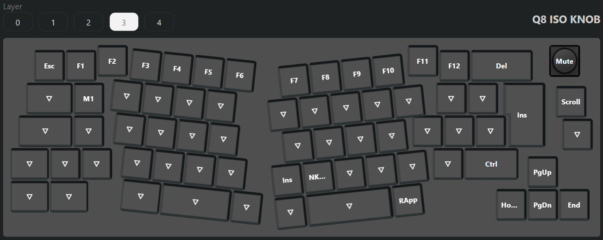
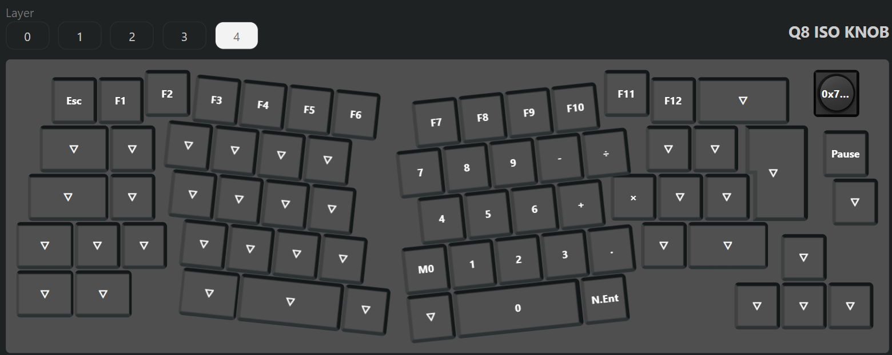
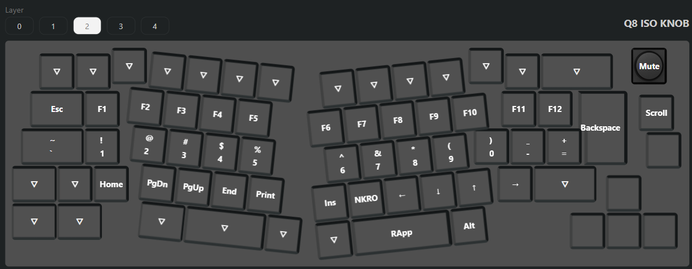

# Custom keymap and FN indicators for Keychron Q8

## Firmware features

* Set TAPPING_TOGGLE to 2
* Highlight FN1 and FN2 buttons when the respective layers are active
* VIA compatible
* Caps Lock indicator on default location

## Keymap

### Default 65% layout

Base - layer 1


FN1 - layer 3



FN2 - layer 4



### Experimental 40% layout

Switch to MAC mode to enable it.

Base - layer 0


FN1 - layer 2



FN2 - layer 4


## Macros

* M0 (Layer 4, B): {+KC_LSFT}{+KC_7}{-KC_7}{-KC_LSFT}
* M1 (Layer 3, Q): {+KC_LALT}{+KC_F4}{-KC_F4}{-KC_LALT}

# QMK Userspace

This is a template repository which allows for an external set of QMK keymaps to be defined and compiled. This is useful for users who want to maintain their own keymaps without having to fork the main QMK repository.

## Howto configure your build targets

1. Run the normal `qmk setup` procedure if you haven't already done so -- see [QMK Docs](https://docs.qmk.fm/#/newbs) for details.
1. Fork this repository
1. Clone your fork to your local machine
1. Enable userspace in QMK config using `qmk config user.overlay_dir="$(realpath qmk_userspace)"`
1. Add a new keymap for your board using `qmk new-keymap`
    * This will create a new keymap in the `keyboards` directory, in the same location that would normally be used in the main QMK repository. For example, if you wanted to add a keymap for the Planck, it will be created in `keyboards/planck/keymaps/<your keymap name>`
    * You can also create a new keymap using `qmk new-keymap -kb <your_keyboard> -km <your_keymap>`
    * Alternatively, add your keymap manually by placing it in the location specified above.
    * `layouts/<layout name>/<your keymap name>/keymap.*` is also supported if you prefer the layout system
1. Add your keymap(s) to the build by running `qmk userspace-add -kb <your_keyboard> -km <your_keymap>`
    * This will automatically update your `qmk.json` file
    * Corresponding `qmk userspace-remove -kb <your_keyboard> -km <your_keymap>` will delete it
    * Listing the build targets can be done with `qmk userspace-list`
1. Commit your changes

## Howto build with GitHub

1. In the GitHub Actions tab, enable workflows
1. Push your changes above to your forked GitHub repository
1. Look at the GitHub Actions for a new actions run
1. Wait for the actions run to complete
1. Inspect the Releases tab on your repository for the latest firmware build

## Howto build locally

1. Run the normal `qmk setup` procedure if you haven't already done so -- see [QMK Docs](https://docs.qmk.fm/#/newbs) for details.
1. Fork this repository
1. Clone your fork to your local machine
1. `cd` into this repository's clone directory
1. Set global userspace path: `qmk config user.overlay_dir="$(realpath .)"` -- you MUST be located in the cloned userspace location for this to work correctly
    * This will be automatically detected if you've `cd`ed into your userspace repository, but the above makes your userspace available regardless of your shell location.
1. Compile normally: `qmk compile -kb your_keyboard -km your_keymap` or `make your_keyboard:your_keymap`

Alternatively, if you configured your build targets above, you can use `qmk userspace-compile` to build all of your userspace targets at once.

## Extra info

If you wish to point GitHub actions to a different repository, a different branch, or even a different keymap name, you can modify `.github/workflows/build_binaries.yml` to suit your needs.

To override the `build` job, you can change the following parameters to use a different QMK repository or branch:
```
    with:
      qmk_repo: qmk/qmk_firmware
      qmk_ref: master
```

If you wish to manually manage `qmk_firmware` using git within the userspace repository, you can add `qmk_firmware` as a submodule in the userspace directory instead. GitHub Actions will automatically use the submodule at the pinned revision if it exists, otherwise it will use the default latest revision of `qmk_firmware` from the main repository.

This can also be used to control which fork is used, though only upstream `qmk_firmware` will have support for external userspace until other manufacturers update their forks.

1. (First time only) `git submodule add https://github.com/qmk/qmk_firmware.git`
1. (To update) `git submodule update --init --recursive`
1. Commit your changes to your userspace repository
