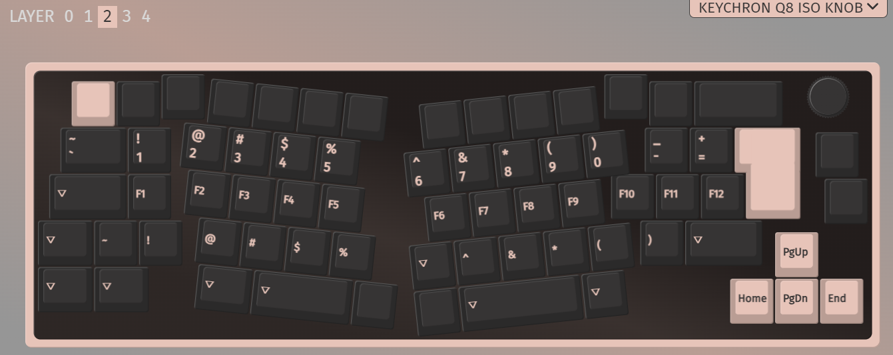
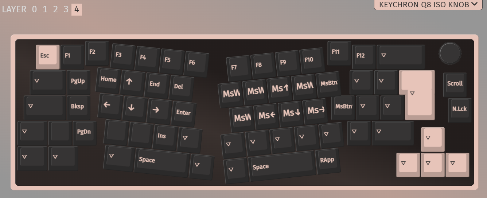

# Custom keymap and FN indicators for Keychron Q8

## Firmware features

* Set TAPPING_TOGGLE to 2
* Highlight FN1 and FN2 buttons when the respective layers are active
* VIA compatible
* Caps Lock indicator on default location

## Keymap

Base with Space + FN - layer 0
Switch to MAC mode to enable this layer.

Base without Space + FN for gaming - layer 1
Switch to Windows mode to enable this layer.

Special characters, macros - layer 2

FN1, numpad - layer 3

FN2, navigation - layer 4

## Macros

* M0 (Layer 4, B): {+KC_LSFT}{+KC_7}{-KC_7}{-KC_LSFT}
* M1 (Layer 3, Q): {+KC_LALT}{+KC_F4}{-KC_F4}{-KC_LALT}
